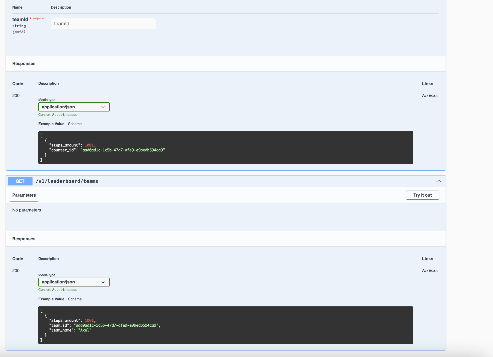

# Apsis

## Run app

Node.js v20 LTS

```
npm install
npm run start:dev
```

Open Swagger Doc http://localhost/docs/#/

## Run e2e tests

```
npm run test:e2e
```

## Directories explanation

The directory structure reflects the Domain Driven Design and Layered Architecture approach.

```
├── src
│   ├── app
│   ├── domain
│   └── infra
└── test
```

`app` - Application layer with use cases
`domain` - Domain layer with entities & services
`infra` - Infrastructure layer with different utils & drivers


---

---

